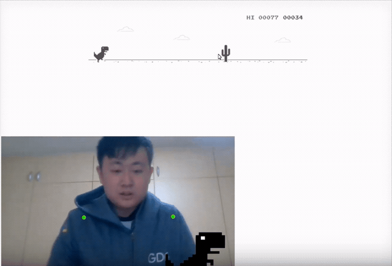

dino-posenet
=====
此專案修改自 [Chrome小恐龍(t-rex-runner)](https://github.com/wayou/t-rex-runner) 的source code, ml5.js的 [PoseNet](https://learn.ml5js.org/docs/#/reference/posenet) 及利用 [p5.js](https://p5js.org/) 的向量運算。點選 [demo](https://alanhc.nctu.me/dino-posenet/) 或點選以下連結可以查看此
## Video

## How to run
just play at  https://alanhc.nctu.me/dino-posenet/

or...

1. clone this project:`git clone https://github.com/DSC-TW/dino-posenet.git`
2. open terminal and type: `python -m http.server 8080`
3. open browser: http://localhost:8080/

